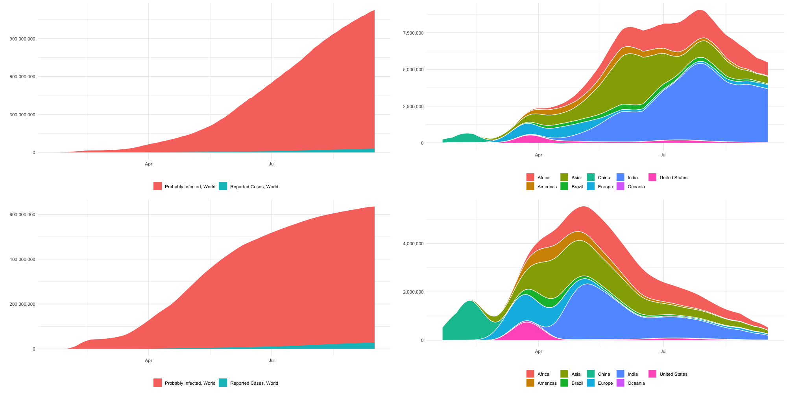
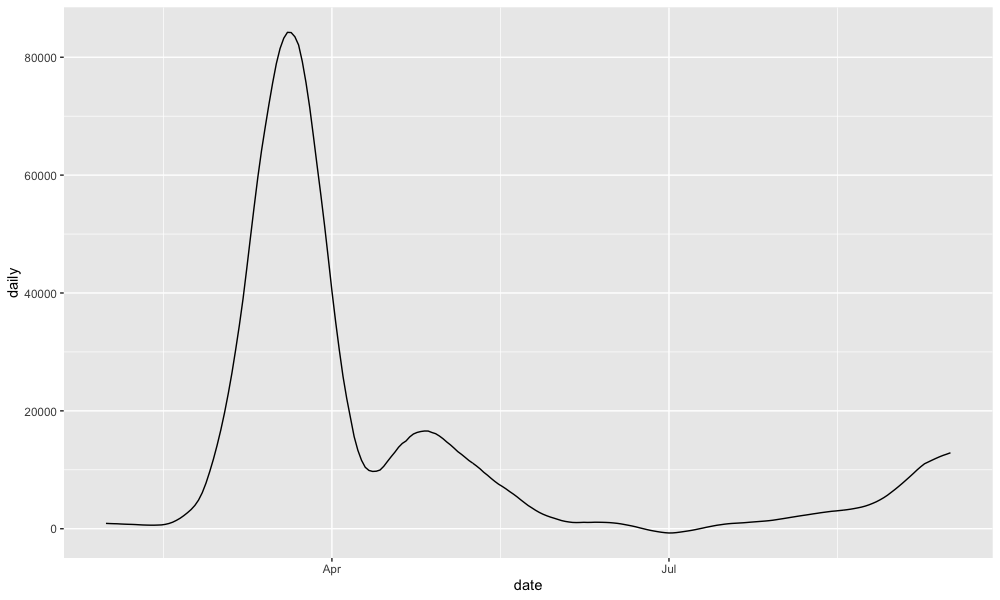

Grim Tallies
============

This is a fork of The Economist's [Grim Tallies](https://github.com/TheEconomist/Grim-Tallies) seroprevalance model. I'm grateful to them for making public their hard-earned data. This started as an attempt to understand their model, became an evaluation, and eventually ended up as a rework.

The main reason seroprevalence data is interesting (for me, at least) is to understand the kind of relationship that reported case/death statistics have to underlying infection rates. Since not all cases are caught, true infection rates are likely higher than official counts by some multiple `C`, which we'd like to estimate (using seroprevalence as a proxy).

A complication is that testing capacity has changed over time, suggesting that `C` might be changing, too. There are three options:

1. Testing capacity has roughly kept apace with rising infection rates, so `C` has remained roughly constant.
2. Exponentially-rising infection rates have outpaced testing, so `C` is increasing over time.
3. Testing has outpaced slowing infection rates, so more cases are being caught, and `C` is decreasing.

The Economist's [recent article](https://www.economist.com/briefing/2020/09/26/the-covid-19-pandemic-is-worse-than-official-figures-show) shows modelling results which seem heavily in favour of option (3) (since their estimated daily cases fall drastically after April, despite official counts rising ever more steeply).

However, this turns out to be an assumption of the model, rather than a conclusion. Seroprevalence is treated as porportional to the log of official counts, which is a very strong assumption in favour of option (3); it implies that new official cases count for 5×10-7 times less than they did at the start of the pandemic [1]. Recent cases are so heavily discounted that the graph's iceberg-like shape (which admittedly makes for a nice visual metaphor) is guaranteed before we've even seen any data.

This assumption might be very accurate – but it may not be, and it's not clear how, or if, it was validated. So I wanted to try fitting a model without it [2], and instead figure out what discount was justified by the data. Here are the results (total world cases and daily new cases by region), with the Economist's plots below for comparison:

These seem, to me, more plausible results, which better match the experience of countries like India and Brazil over August. The model still learns to discount more recent cases, just nowhere near as strongly as in the original. One surprise is that, whereas the April peak in global death counts is larger than the August one, the model predicts a much higher peak in August. This seems somewhat plausible, though, given that the countries affected in August may be reporting less accurate death counts; alongside that, treatment has improved and the more vulnerable may have been more affected early on. (Note also that the original model thinks that cases had mostly died away by August, which is surely even less likely.)

There are of course still uncertainties in the data, which may inflate the estimate; lower-GDP countries are not as well represented, and high prevalence (and GDP) may make it more likely that a serosurvey gets carried out. There are principled ways to adjust for these things, and I may extend this model to try that.

It's important to note that this is probably an overestimate of total global cases; the WHO suggests 10% of the world population (ie 800M) as an upper bound. This bound also seems to be a major motivation for the Economist's log-cases assumption. I definitely agree that you should listen to the WHO before me (and before the Economist). On the other hand, the point of this statistical excercise is to let the data speak for itself; if you want to draw a line through a single estimate, it's much easier to do that with pencil and paper.

---

[1] The number of new estimated cases given one new official case is `dS/dx ∝ d/dx(log(x)) = 1/x`. The highest and lowest case rates are 7.2×10-10 and 0.042, implying that `dS` varies by a factor of 5×107 (the model parameters modify `dS` by a factor, but this doesn't change the ratio).

[2] Another oddity is that the original model uses a Gaussian approximation (linear regression) to data that is roughly binomial (binary tests of a small subset of a population), with small `N` and `p`. I don't think this is the cause of my major concerns with the model, but at any rate, I used binomial regression.

UK estimated daily cases:

